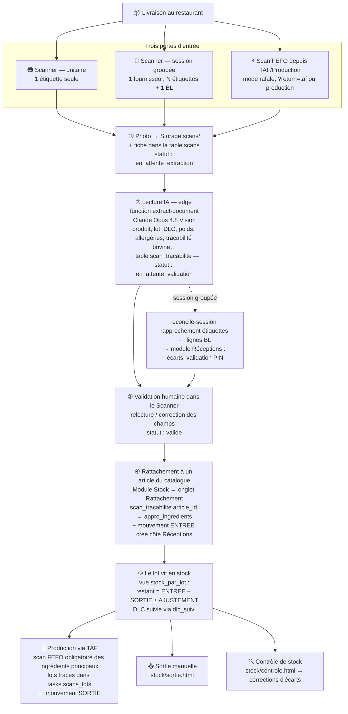

# Workflow des étiquettes de matières premières — PlanB-Tools

> Document de référence : le parcours complet d'une étiquette MP, de la livraison
> à la consommation en production. État réel du code au 11/06/2026 (vérifié fichier
> par fichier). Pour le détail des modules qui se chevauchent et leur historique,
> voir `CHANTIERS-ARCHIVES.md`.

## Vue d'ensemble

## Les étapes en détail

### ① Capture — trois portes d'entrée vers le même tuyau

| Porte | Quand | Particularité |
|---|---|---|
| **Scanner unitaire** | une étiquette isolée à enregistrer | flux simple |
| **Session groupée** (`mode sburst`) | une livraison complète : 1 fournisseur, N étiquettes + 1 BL/facture | déclenche le rapprochement automatique |
| **Scan FEFO** depuis TAF/Production (`mode burst`, `?return=taf` / `?return=production`) | au démarrage d'une tâche de production dont la fiche a des ingrédients principaux (`fiche_ingredients.est_principal`) | le scanner rend la main au module appelant via `localStorage` (`scan_fefo_context` / `scan_fefo_result`) |

La photo part dans le bucket Storage `scans/`, une ligne est créée dans la table
`scans` (statut `en_attente_extraction`).

### ② Lecture par l'IA

L'edge function **`extract-document`** (Supabase) télécharge l'image et l'envoie à
**Claude Opus 4.8 Vision** (bascule depuis Haiku 4.5 le 11/06/2026 pour la fiabilité).
Elle extrait en JSON : produit, catégorie, fabricant, estampille sanitaire, lot, DLC/DDM,
poids net, températures de conservation, ingrédients, allergènes, traçabilité bovine
(né/élevé/abattu/découpé), couleur et type de contenant, plus un score de confiance.

Résultat écrit dans **`scan_tracabilite`** (le registre HACCP). Statuts de la fiche
`scans` : `en_attente_extraction` → `extraction_en_cours` → `extrait` →
`en_attente_validation` → `valide` (ou `erreur`).

### ③ Validation humaine

Dans le Scanner, on relit et corrige les champs extraits. En session groupée,
l'edge function **`reconcile-session`** rapproche automatiquement chaque étiquette
des lignes du BL ; le module **Réceptions** affiche les correspondances et les
anomalies (écarts de poids/quantité, produits manquants) et la session est validée
par code PIN.

### ④ Rattachement au catalogue — l'étape qui fait « exister » le stock

Module **Stock → Rattachement Étiquettes/Article** : on relie l'étiquette à un
article du catalogue commun (`appro_ingredients`) en renseignant
`scan_tracabilite.article_id`. Le mouvement de stock **ENTREE** (en kg) est créé
côté module Réceptions.

> ⚠️ Point clé : une étiquette scannée et validée n'est **pas encore du stock**.
> Tant qu'elle n'est pas rattachée + entrée créée, elle apparaît « 0 lot » dans
> les vues de stock.

### ⑤ Vie en stock

La vue **`stock_par_lot`** (vue SQL, pas une table) calcule le restant de chaque
lot : `ENTREE − SORTIE ± AJUSTEMENT` à partir du journal **`stock_mouvements`**
(la source de vérité). La DLC de chaque lot est suivie via `dlc_suivi`.

### ⑥ Consommation — la sortie de stock

| Chemin | Module | Trace |
|---|---|---|
| **Production via TAF** | `taf/` + `production/` | scan FEFO au démarrage, lots consommés mémorisés dans `tasks.scans_lots` (JSONB), mouvement `SORTIE` à la validation de la tâche |
| **Sortie manuelle** | `stock/sortie.html`, `stock/sortie-production.html` | mouvement `SORTIE` avec motif |
| **Contrôle de stock** | `stock/controle.html` | comptage physique → corrections d'écarts |
| **Réouverture d'une production** | `production/` | recrée un mouvement `ENTREE` (annulation du prélèvement) |

## Tables impliquées (mémo)

| Table / vue | Rôle |
|---|---|
| `scans` | la fiche du document scanné (photo, statut, coût IA, qui/quand) |
| `scan_tracabilite` | le détail HACCP extrait de l'étiquette + lien article (`article_id`) |
| `scan_sessions` | les sessions de réception groupée |
| `scan_lignes` | les lignes extraites des BL/factures |
| `appro_ingredients` | le catalogue d'articles (commun aux deux établissements) |
| `stock_mouvements` | le journal ENTREE/SORTIE/AJUSTEMENT — source de vérité du stock |
| `stock_par_lot` | **vue** calculée : restant par lot |
| `dlc_suivi` | suivi des DLC |
| `tasks.scans_lots` | (colonne JSONB du TAF) lots consommés par une tâche de production |

## Chantiers connexes en sommeil

- **Appro Phase 2** : scanner les lots à la réception d'une commande appro (bouton désactivé).
- **Prélèvement de stock** : sortir une portion d'un lot avec étiquette enfant (tables prêtes, pas d'UI).

Détails et comment les reprendre : voir `CHANTIERS-ARCHIVES.md`.
